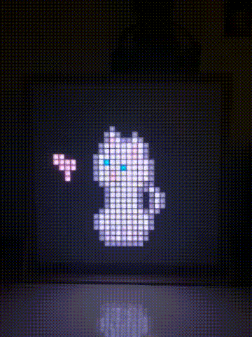
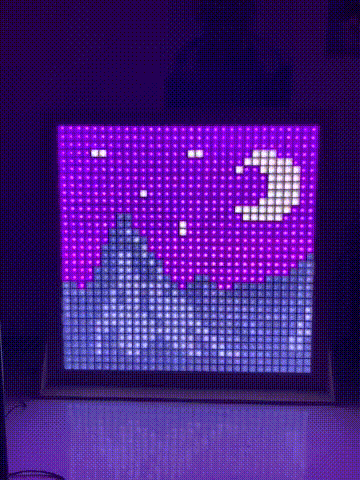
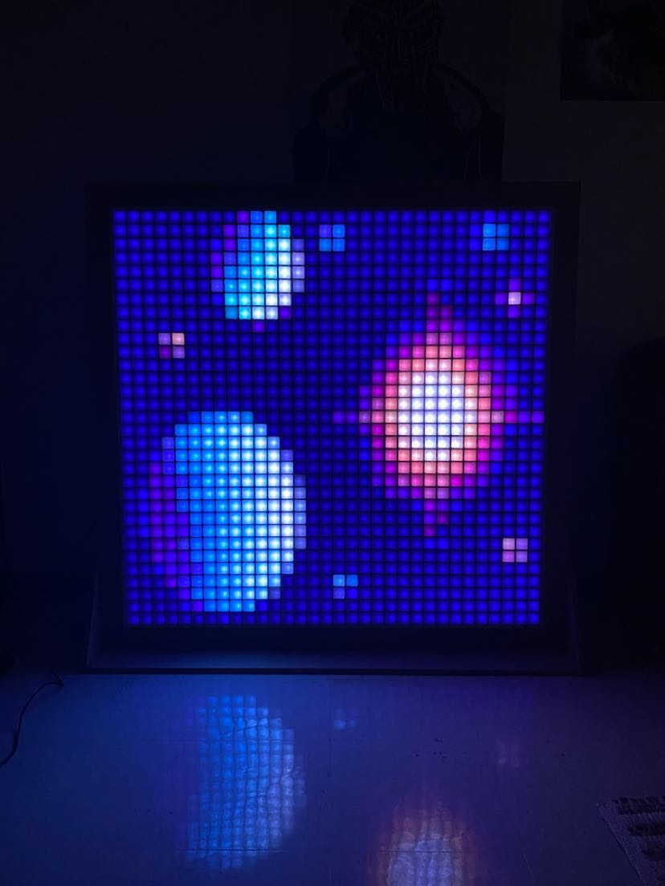
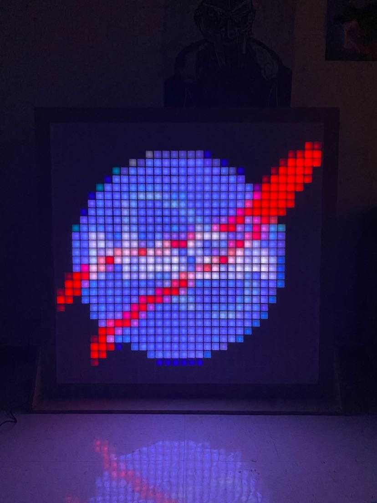
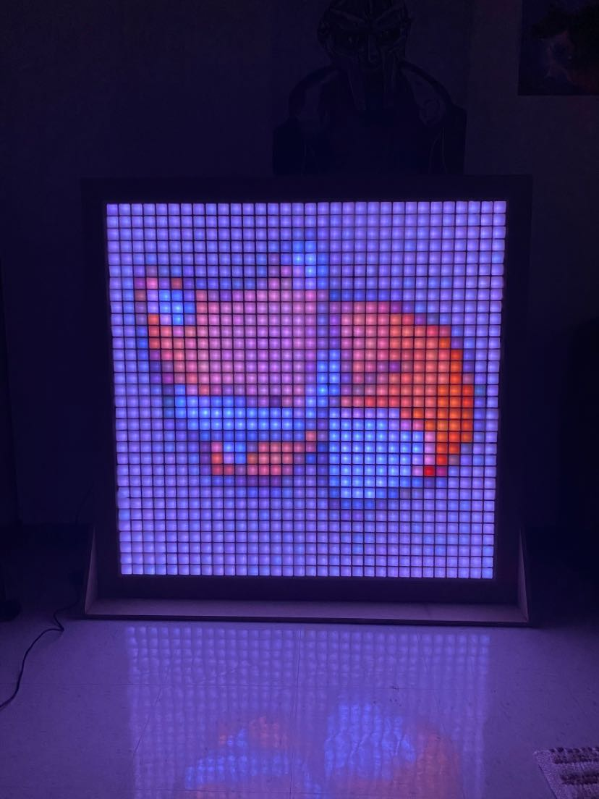
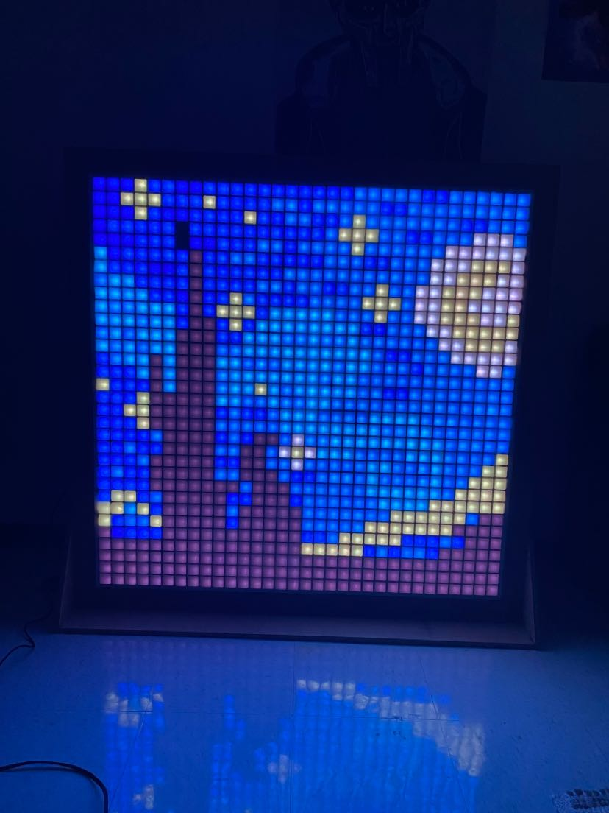

## Project Description

LightFrame is a collaborative project undertaken by Omer Sezer and Georges Ouweijan. It consists of 32x32 grid of WS2812b (NeoPixel) LED Strips on a large wooden frame, overlayed by a pixel isolating grid and covered by a diffusion sheet. This creates a large LED screen which is used to display pixel art images, gifs, and videos. It can be controlled by a custom website that allows users to turn the screen on and off, control brightness, upload media files, and select which files should be played and for how long. 

## Features

- 32x32 Neopixel LED screen.
- Support for displaying PNG images, GIF animations, and MP4 videos.
- Optimized frame loading using worker threads.
- A REST API for remote control and media upload.
- User-friendly web interface for controlling brightness and screen power.

## Videos / GIFS

## Images 

## Acknowledgments

We would like to thank Kyle Trigo and David Trigo for providing resources, expertise, and material to phyiscally construct LightFrame. Their help was instrumental in making LightFrame come to fruition.

---
